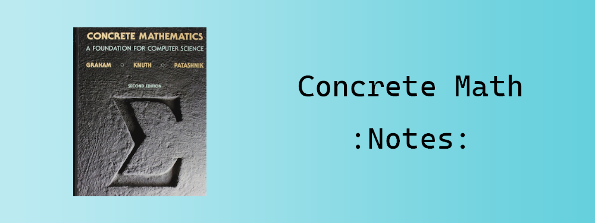

# 具体数学 (原书第二版) 中文版 读书笔记

本仓库包含我的《具体数学 (原书第二版) 》读书笔记索引 (可能还有验证用的代码)。

作业答案并不是每道题都记录，主要旨在补充答案没有提到的细节。普通的演算可能会跳步。

如果有题目并未被包含进笔记，欢迎提 Issue。

注意：虽然本仓库是 GNU v2.0 授权的，但是大部分文章都是指向我的博客和我博客所在的仓库，其文章内容是根据 CC BY 4.0 授权的。所以，转载请务必保留出处，可以是本仓库，或是原文链接。

| 章节位置 | 内容链接 | 源文件 |
| :------: | :------: | :---: |
| §1.3 约瑟夫问题 | [深入理解成套方法](https://gyrojeff.top/index.php/archives/repertoire-method/) | [Link](https://github.com/JeffersonQin/gyrojeff.top/blob/master/posts/2022/3/深入理解成套方法.md) |
| §1.3 约瑟夫问题 | [约瑟夫问题 旁注](https://gyrojeff.top/index.php/archives/concrete-math-josephus-problem-note/) | [Link](https://github.com/JeffersonQin/gyrojeff.top/blob/master/posts/2022/3/具体数学-约瑟夫问题-旁注.md) |
| §1 递归问题 | [递归问题 热身题答案](https://gyrojeff.top/index.php/archives/concrete-math-recurrent-problems-homework-warmup/) | [Link](https://github.com/JeffersonQin/gyrojeff.top/blob/master/posts/2022/3/具体数学-递归问题-热身题答案.md) |
| §1 递归问题 | [递归问题 作业题答案](https://gyrojeff.top/index.php/archives/concrete-math-recurrent-problems-homework/) | [Link](https://github.com/JeffersonQin/gyrojeff.top/blob/master/posts/2022/3/具体数学-递归问题-作业题答案.md) |
| §1 递归问题 | [递归问题 考试题答案](https://gyrojeff.top/index.php/archives/concrete-math-recurrent-problems-exam/) | [Link](https://github.com/JeffersonQin/gyrojeff.top/blob/master/posts/2022/3/具体数学-递归问题-考试题答案.md) |
| §2 和式 | [和式 旁注](https://gyrojeff.top/index.php/archives/concrete-math-sum-notes/) | [Link](https://github.com/JeffersonQin/gyrojeff.top/blob/master/posts/2022/3/具体数学-和式-旁注.md) |
| §2.7 无限和式 | [理解无限和式](https://gyrojeff.top/index.php/archives/understand-infinite-sum/) | [Link](https://github.com/JeffersonQin/gyrojeff.top/blob/master/posts/2022/3/理解无限和式.md) |
| §3.5 底和顶的和式 | [无理数分数分布定理推导](https://gyrojeff.top/index.php/archives/无理数倍数分数部分分布均匀阐释的推理/) | [Link](https://github.com/JeffersonQin/gyrojeff.top/blob/master/posts/2022/3/无理数倍数分数部分分布均匀阐释的推理.md) |
| §3 整值函数 | [习题 3.22](https://gyrojeff.top/index.php/archives/a-difficult-exercise-of-ceil-and-floor-sum/) | [Link](https://github.com/JeffersonQin/gyrojeff.top/blob/master/posts/2022/3/底和顶和式一道难蚌的习题.md) |
| §4.1 整除性 | [(扩展)欧几里得算法](https://gyrojeff.top/index.php/archives/euclidean-algorithm/) | [Link](https://github.com/JeffersonQin/gyrojeff.top/blob/master/posts/2022/3/欧几里得算法.md) |
| §4.1 整除性 | [裴蜀定理](https://gyrojeff.top/index.php/archives/裴蜀定理/) | [Link](https://github.com/JeffersonQin/gyrojeff.top/blob/master/posts/2022/3/裴蜀定理.md) |
| §4.2 素数 | [素数 旁注](https://gyrojeff.top/index.php/archives/concrete-math-primes-notes/) | [Link](https://github.com/JeffersonQin/gyrojeff.top/blob/master/posts/2022/3/具体数学-素数-旁注.md) |
| §4.3 素数的例子 | [素数的例子 旁注](https://gyrojeff.top/index.php/archives/concrete-math-prime-examples-notes/) | [Link](https://github.com/JeffersonQin/gyrojeff.top/blob/master/posts/2022/3/具体数学-素数的例子-旁注.md) |
| §4.4 阶乘的因子 | [阶乘的因子 旁注](https://gyrojeff.top/index.php/archives/concrete-math-factorial-factors-notes/) | [Link](https://github.com/JeffersonQin/gyrojeff.top/blob/master/posts/2022/3/具体数学-阶乘的因子-旁注.md) |
| §4.5 互素 | [Stern-Brocot 树性质证明](https://gyrojeff.top/index.php/archives/stern-brocot-tree-properties/) | [Link](https://github.com/JeffersonQin/gyrojeff.top/blob/master/posts/2022/3/Stern-Brocot-Tree-性质的证明.md) |
| §4.5 互素 | [互素 旁注](https://gyrojeff.top/index.php/archives/concrete-math-relative-primality-notes/) | [Link](https://github.com/JeffersonQin/gyrojeff.top/blob/master/posts/2022/3/具体数学-互素-旁注.md) |
| §4.6 同余关系 | [同余关系 旁注](https://gyrojeff.top/index.php/archives/concrete-math-mod-relation-notes/) | [Link](https://github.com/JeffersonQin/gyrojeff.top/blob/master/posts/2022/3/具体数学-同余关系-旁注.md) |
| §4.7 独立剩余 | [独立剩余 旁注](https://gyrojeff.top/index.php/archives/concrete-math-independent-residue-notes/) | [Link](https://github.com/JeffersonQin/gyrojeff.top/blob/master/posts/2022/3/具体数学-独立剩余-旁注.md) |
| §4.8 进一步的应用 | [进一步的应用 旁注](https://gyrojeff.top/index.php/archives/concrete-math-number-theory-application-notes/) | [Link](https://github.com/JeffersonQin/gyrojeff.top/blob/master/posts/2022/3/具体数学-数论的进一步应用-旁注.md) |
| §4.8 进一步的应用 | [威尔逊定理 补充](https://gyrojeff.top/index.php/archives/concrete-math-wilson-theorem/) | [Link](https://github.com/JeffersonQin/gyrojeff.top/blob/master/posts/2022/3/具体数学-威尔逊定理-补充.md) |
| §4.9 φ函数与μ函数 | [欧拉定理 证明](https://gyrojeff.top/index.php/archives/concrete-math-euler-theorem-proof/) | [Link](https://github.com/JeffersonQin/gyrojeff.top/blob/master/posts/2022/3/具体数学-数论-欧拉定理-证明.md) |
| §4.9 φ函数与μ函数 | [φ函数 旁注](https://gyrojeff.top/index.php/archives/concrete-math-phi/) | [Link](https://github.com/JeffersonQin/gyrojeff.top/blob/master/posts/2022/3/具体数学-φ函数-旁注.md) |
| §4.9 φ函数与μ函数 | [μ函数 旁注](https://gyrojeff.top/index.php/archives/concrete-math-mu/) | [Link](https://github.com/JeffersonQin/gyrojeff.top/blob/master/posts/2022/3/具体数学-μ函数-旁注.md) |
| §4.9 φ函数与μ函数 | [项链问题 旁注](https://gyrojeff.top/index.php/archives/concrete-math-number-theory-necklace-problem/) | [Link](https://github.com/JeffersonQin/gyrojeff.top/blob/master/posts/2022/3/具体数学-数论-项链问题.md) |
| §4 数论 | [中国剩余定理](https://gyrojeff.top/index.php/archives/中国剩余定理/) | [Link](https://github.com/JeffersonQin/gyrojeff.top/blob/master/posts/2022/3/中国剩余定理.md) |
| §4 数论 | [数论 热身题答案](https://gyrojeff.top/index.php/archives/concrete-math-number-theory-warmup/) | [Link](https://github.com/JeffersonQin/gyrojeff.top/blob/master/posts/2022/3/具体数学-数论-热身题答案.md) |
| §4 数论 | [数论 基础题答案](https://gyrojeff.top/index.php/archives/concrete-math-number-theory-basics/) | [Link](https://github.com/JeffersonQin/gyrojeff.top/blob/master/posts/2022/3/具体数学-数论-基础题答案.md) |
